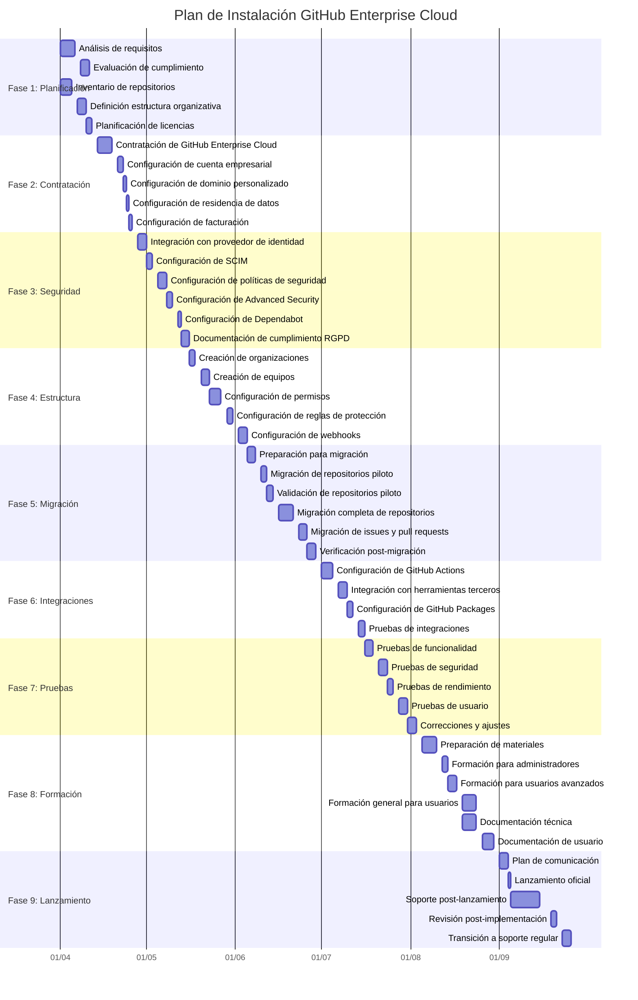

```mermaid
gantt
    title Plan de Instalación GitHub Enterprise Cloud
    dateFormat  YYYY-MM-DD
    axisFormat %d/%m
    todayMarker off
    
    section Fase 1: Planificación
    Análisis de requisitos           :2025-04-01, 5d
    Evaluación de cumplimiento       :2025-04-08, 3d
    Inventario de repositorios       :2025-04-01, 4d
    Definición estructura organizativa:2025-04-07, 3d
    Planificación de licencias       :2025-04-10, 2d
    
    section Fase 2: Contratación
    Contratación de GitHub Enterprise Cloud :2025-04-14, 5d
    Configuración de cuenta empresarial     :2025-04-21, 2d
    Configuración de dominio personalizado  :2025-04-23, 1d
    Configuración de residencia de datos    :2025-04-24, 1d
    Configuración de facturación            :2025-04-25, 1d
    
    section Fase 3: Seguridad
    Integración con proveedor de identidad :2025-04-28, 3d
    Configuración de SCIM                  :2025-05-01, 2d
    Configuración de políticas de seguridad :2025-05-05, 3d
    Configuración de Advanced Security     :2025-05-08, 2d
    Configuración de Dependabot            :2025-05-12, 1d
    Documentación de cumplimiento RGPD     :2025-05-13, 3d
    
    section Fase 4: Estructura
    Creación de organizaciones            :2025-05-16, 2d
    Creación de equipos                   :2025-05-20, 3d
    Configuración de permisos             :2025-05-23, 4d
    Configuración de reglas de protección :2025-05-29, 2d
    Configuración de webhooks             :2025-06-02, 3d
    
    section Fase 5: Migración
    Preparación para migración        :2025-06-05, 3d
    Migración de repositorios piloto  :2025-06-10, 2d
    Validación de repositorios piloto :2025-06-12, 2d
    Migración completa de repositorios:2025-06-16, 5d
    Migración de issues y pull requests:2025-06-23, 3d
    Verificación post-migración       :2025-06-26, 3d
    
    section Fase 6: Integraciones
    Configuración de GitHub Actions      :2025-07-01, 4d
    Integración con herramientas terceros:2025-07-07, 3d
    Configuración de GitHub Packages     :2025-07-10, 2d
    Pruebas de integraciones             :2025-07-14, 2d
    
    section Fase 7: Pruebas
    Pruebas de funcionalidad :2025-07-16, 3d
    Pruebas de seguridad     :2025-07-21, 3d
    Pruebas de rendimiento   :2025-07-24, 2d
    Pruebas de usuario       :2025-07-28, 3d
    Correcciones y ajustes   :2025-07-31, 3d
    
    section Fase 8: Formación
    Preparación de materiales      :2025-08-05, 5d
    Formación para administradores :2025-08-12, 2d
    Formación para usuarios avanzados:2025-08-14, 3d
    Formación general para usuarios:2025-08-19, 5d
    Documentación técnica          :2025-08-19, 5d
    Documentación de usuario       :2025-08-26, 4d
    
    section Fase 9: Lanzamiento
    Plan de comunicación           :2025-09-01, 3d
    Lanzamiento oficial            :2025-09-04, 1d
    Soporte post-lanzamiento       :2025-09-05, 10d
    Revisión post-implementación   :2025-09-19, 2d
    Transición a soporte regular   :2025-09-23, 3d
```
