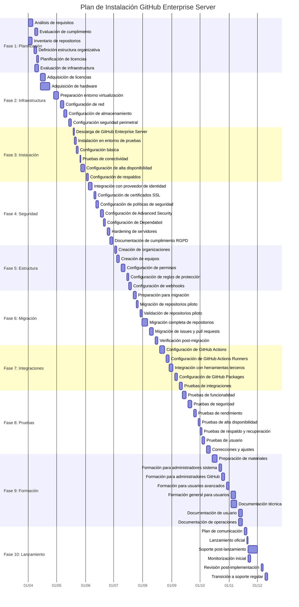

```mermaid
gantt
    title Plan de Instalación GitHub Enterprise Server
    dateFormat  YYYY-MM-DD
    axisFormat %d/%m
    todayMarker off
    
    section Fase 1: Planificación
    Análisis de requisitos           :2025-04-01, 5d
    Evaluación de cumplimiento       :2025-04-08, 3d
    Inventario de repositorios       :2025-04-01, 4d
    Definición estructura organizativa:2025-04-07, 3d
    Planificación de licencias       :2025-04-10, 2d
    Evaluación de infraestructura    :2025-04-08, 4d
    
    section Fase 2: Infraestructura
    Adquisición de licencias         :2025-04-14, 5d
    Adquisición de hardware          :2025-04-14, 10d
    Preparación entorno virtualización:2025-04-28, 5d
    Configuración de red             :2025-05-05, 4d
    Configuración de almacenamiento  :2025-05-09, 3d
    Configuración seguridad perimetral:2025-05-14, 3d
    
    section Fase 3: Instalación
    Descarga de GitHub Enterprise Server :2025-05-19, 1d
    Instalación en entorno de pruebas    :2025-05-20, 2d
    Configuración básica                 :2025-05-22, 2d
    Pruebas de conectividad              :2025-05-26, 1d
    Configuración de alta disponibilidad :2025-05-27, 4d
    Configuración de respaldos           :2025-06-02, 2d
    
    section Fase 4: Seguridad
    Integración con proveedor de identidad :2025-06-04, 4d
    Configuración de certificados SSL      :2025-06-10, 2d
    Configuración de políticas de seguridad :2025-06-12, 3d
    Configuración de Advanced Security     :2025-06-17, 3d
    Configuración de Dependabot            :2025-06-20, 2d
    Hardening de servidores                :2025-06-24, 3d
    Documentación de cumplimiento RGPD     :2025-06-27, 3d
    
    section Fase 5: Estructura
    Creación de organizaciones            :2025-07-02, 2d
    Creación de equipos                   :2025-07-04, 3d
    Configuración de permisos             :2025-07-09, 4d
    Configuración de reglas de protección :2025-07-15, 2d
    Configuración de webhooks             :2025-07-17, 3d
    
    section Fase 6: Migración
    Preparación para migración        :2025-07-22, 3d
    Migración de repositorios piloto  :2025-07-25, 2d
    Validación de repositorios piloto :2025-07-29, 2d
    Migración completa de repositorios:2025-07-31, 6d
    Migración de issues y pull requests:2025-08-08, 4d
    Verificación post-migración       :2025-08-14, 3d
    
    section Fase 7: Integraciones
    Configuración de GitHub Actions      :2025-08-19, 5d
    Configuración de GitHub Actions Runners :2025-08-26, 3d
    Integración con herramientas terceros:2025-08-29, 4d
    Configuración de GitHub Packages     :2025-09-04, 3d
    Pruebas de integraciones             :2025-09-09, 3d
    
    section Fase 8: Pruebas
    Pruebas de funcionalidad         :2025-09-12, 4d
    Pruebas de seguridad             :2025-09-18, 4d
    Pruebas de rendimiento           :2025-09-24, 3d
    Pruebas de alta disponibilidad   :2025-09-29, 2d
    Pruebas de respaldo y recuperación:2025-10-01, 2d
    Pruebas de usuario               :2025-10-03, 3d
    Correcciones y ajustes           :2025-10-08, 4d
    
    section Fase 9: Formación
    Preparación de materiales           :2025-10-14, 5d
    Formación para administradores sistema :2025-10-21, 3d
    Formación para administradores GitHub :2025-10-24, 3d
    Formación para usuarios avanzados   :2025-10-29, 3d
    Formación general para usuarios     :2025-11-03, 5d
    Documentación técnica               :2025-11-03, 6d
    Documentación de usuario            :2025-11-11, 4d
    Documentación de operaciones        :2025-11-11, 4d
    
    section Fase 10: Lanzamiento
    Plan de comunicación           :2025-11-17, 3d
    Lanzamiento oficial            :2025-11-20, 1d
    Soporte post-lanzamiento       :2025-11-21, 10d
    Monitorización inicial         :2025-11-21, 3d
    Revisión post-implementación   :2025-12-05, 2d
    Transición a soporte regular   :2025-12-09, 3d
```
