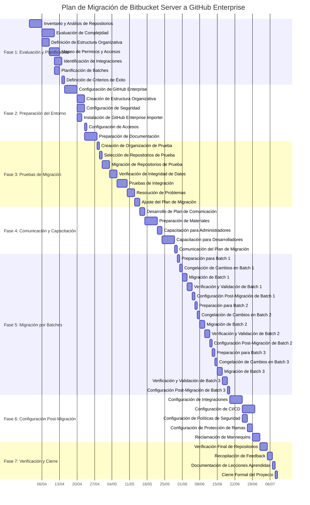

```mermaid
gantt
    title Plan de Migración de Bitbucket Server a GitHub Enterprise
    dateFormat  YYYY-MM-DD
    axisFormat %d/%m
    todayMarker off
    
    section Fase 1: Evaluación y Planificación
    Inventario y Análisis de Repositorios       :f1_1, 2025-04-01, 5d
    Evaluación de Complejidad                   :f1_2, after f1_1, 5d
    Definición de Estructura Organizativa       :f1_3, after f1_1, 3d
    Mapeo de Permisos y Accesos                 :f1_4, after f1_3, 4d
    Identificación de Integraciones             :f1_5, after f1_2, 3d
    Planificación de Batches                    :f1_6, after f1_2, 2d
    Definición de Criterios de Éxito            :f1_7, after f1_5 f1_6, 1d
    
    section Fase 2: Preparación del Entorno
    Configuración de GitHub Enterprise          :f2_1, after f1_7, 5d
    Creación de Estructura Organizativa         :f2_2, after f2_1, 3d
    Configuración de Seguridad                  :f2_3, after f2_1, 3d
    Instalación de GitHub Enterprise Importer   :f2_4, after f2_1, 2d
    Configuración de Accesos                    :f2_5, after f2_3, 1d
    Preparación de Documentación                :f2_6, after f2_2, 5d
    
    section Fase 3: Pruebas de Migración
    Creación de Organización de Prueba          :f3_1, after f2_5 f2_6, 1d
    Selección de Repositorios de Prueba         :f3_2, after f3_1, 1d
    Migración de Repositorios de Prueba         :f3_3, after f3_2, 3d
    Verificación de Integridad de Datos         :f3_4, after f3_3, 3d
    Pruebas de Integración                      :f3_5, after f3_4, 4d
    Resolución de Problemas                     :f3_6, after f3_5, 3d
    Ajuste del Plan de Migración                :f3_7, after f3_6, 2d
    
    section Fase 4: Comunicación y Capacitación
    Desarrollo de Plan de Comunicación          :f4_1, after f3_7, 2d
    Preparación de Materiales                   :f4_2, after f4_1, 5d
    Capacitación para Administradores           :f4_3, after f4_2, 2d
    Capacitación para Desarrolladores           :f4_4, after f4_3, 5d
    Comunicación del Plan de Migración          :f4_5, after f4_4, 1d
    
    section Fase 5: Migración por Batches
    Preparación para Batch 1                    :f5_1, after f4_5, 1d
    Congelación de Cambios en Batch 1           :f5_2, after f5_1, 1d
    Migración de Batch 1                        :f5_3, after f5_2, 2d
    Verificación y Validación de Batch 1        :f5_4, after f5_3, 2d
    Configuración Post-Migración de Batch 1     :f5_5, after f5_4, 1d
    Preparación para Batch 2                    :f5_6, after f5_5, 1d
    Congelación de Cambios en Batch 2           :f5_7, after f5_6, 1d
    Migración de Batch 2                        :f5_8, after f5_7, 2d
    Verificación y Validación de Batch 2        :f5_9, after f5_8, 2d
    Configuración Post-Migración de Batch 2     :f5_10, after f5_9, 1d
    Preparación para Batch 3                    :f5_11, after f5_10, 1d
    Congelación de Cambios en Batch 3           :f5_12, after f5_11, 1d
    Migración de Batch 3                        :f5_13, after f5_12, 2d
    Verificación y Validación de Batch 3        :f5_14, after f5_13, 2d
    Configuración Post-Migración de Batch 3     :f5_15, after f5_14, 1d
    
    section Fase 6: Configuración Post-Migración
    Configuración de Integraciones              :f6_1, after f5_15, 5d
    Configuración de CI/CD                      :f6_2, after f6_1, 5d
    Configuración de Políticas de Seguridad     :f6_3, after f6_1, 2d
    Configuración de Protección de Ramas        :f6_4, after f6_3, 2d
    Reclamación de Mannequins                   :f6_5, after f6_4, 3d
    
    section Fase 7: Verificación y Cierre
    Verificación Final de Repositorios          :f7_1, after f6_5 f6_2, 3d
    Recopilación de Feedback                    :f7_2, after f7_1, 2d
    Documentación de Lecciones Aprendidas       :f7_3, after f7_2, 1d
    Cierre Formal del Proyecto                  :f7_4, after f7_3, 1d
```
